# Saved Places App

Ứng dụng lưu địa điểm yêu thích (quán café, công viên, nhà bạn bè...) và tìm các
địa điểm gần 1 vị trí cho trước. Hỗ trợ đồng bộ từ nhiều thiết bị mà không tạo
dữ liệu trùng lặp.

> Xem `DECISIONS.md` để biết chi tiết cách tiếp cận, các đánh đổi và lý do
> thiết kế — đây là phần quan trọng nhất của repo này.

## Yêu cầu môi trường

- Node.js >= 18
- MongoDB (local hoặc MongoDB Atlas)

## Cấu trúc thư mục

```
.
├── BE/      # Backend — Express + Prisma (MongoDB)
└── FE/      # Frontend — React
```

> Nếu cấu trúc thư mục thực tế của bạn đặt tên khác (VD `backend/`, `web/`),
> chỉ cần `cd` vào đúng thư mục tương ứng khi làm theo các bước dưới đây.

## 1. Chạy Backend

```bash
cd BE
npm install
```

File `.env` đã có sẵn trong repo (không chứa key/secret nhạy cảm, chỉ dùng
MongoDB server + các ngưỡng cấu hình dedup), nên **không cần tạo thêm** —
chạy thẳng bước tiếp theo.

Sinh Prisma Client và đồng bộ schema xuống database:

```bash
npx run build
npx run push
```

Chạy server ở chế độ dev:

```bash
npm run dev
```

Backend mặc định chạy tại `http://localhost:3000`.

## 2. Chạy Frontend

Mở 1 terminal khác:

```bash
cd FE
npm install
```

File `.env` cũng đã có sẵn trong repo, không cần tạo thêm.

Chạy frontend ở chế độ dev:

```bash
npm run dev
```

Frontend mặc định chạy tại `http://localhost:5173` (Vite) hoặc `http://localhost:3000`
(Create React App) — xem log trong terminal để biết chính xác cổng đang chạy.


## Hướng dẫn sử dụng
 
### 1. Đăng nhập / Đăng ký
 
Màn hình đầu tiên khi vào trang web là nhập username. Nếu username đã tồn
tại trước đó, hệ thống coi như đăng nhập; nếu chưa, một tài khoản mới sẽ
được tạo tự động (đăng ký).
 
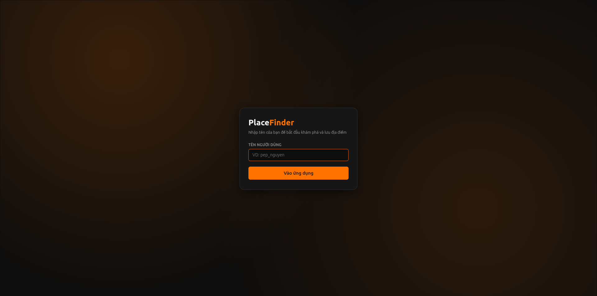
 
### 2. Màn hình chính
 
Sau khi đăng nhập, màn hình chính gồm 2 phần: **Sidebar** bên trái và
**bản đồ** bên phải.
 
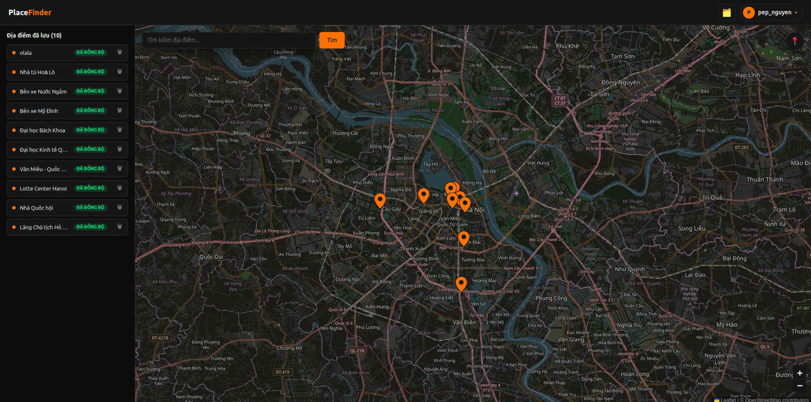
 
### 3. Sidebar — danh sách địa điểm đã lưu
 
Sidebar hiển thị danh sách các địa điểm user đã lưu trước đó.
 
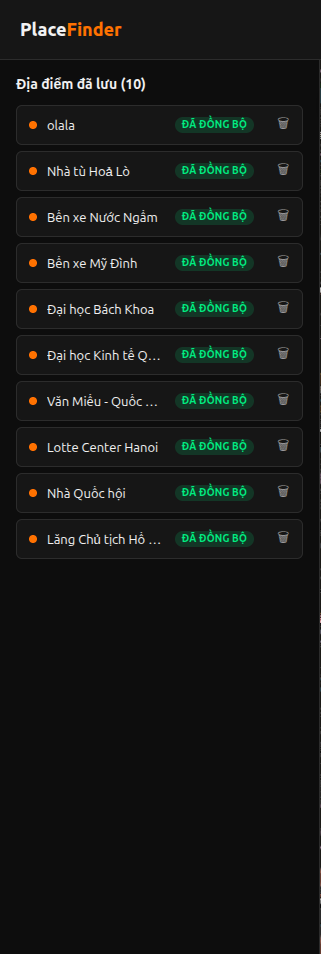
 
### 4. Bản đồ — đánh dấu địa điểm
 
Bản đồ đánh dấu các địa điểm tương ứng với danh sách hiển thị ở sidebar.
 
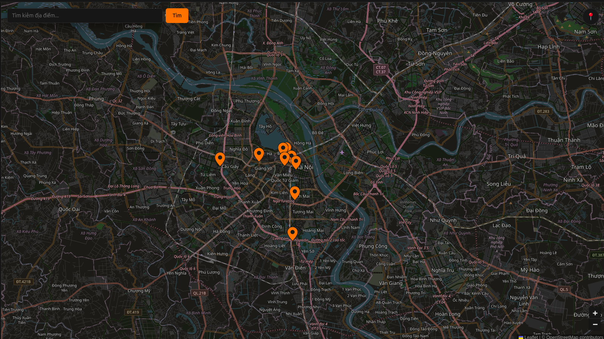
 
### 5. Tìm kiếm địa điểm trên bản đồ
 
Phía trên bên trái màn hình bản đồ có thanh tìm kiếm để tra cứu địa điểm.
 
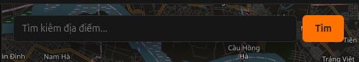
 
### 6. Định vị vị trí hiện tại
 
Phía trên bên phải màn hình bản đồ có icon định vị — bấm vào sẽ chuyển bản
đồ đến vị trí hiện tại của user.
 
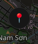
 
### 7. Chọn địa điểm từ Sidebar
 
Khi bấm vào 1 địa điểm ở sidebar, bản đồ sẽ tự động chuyển đến địa điểm đó.
 
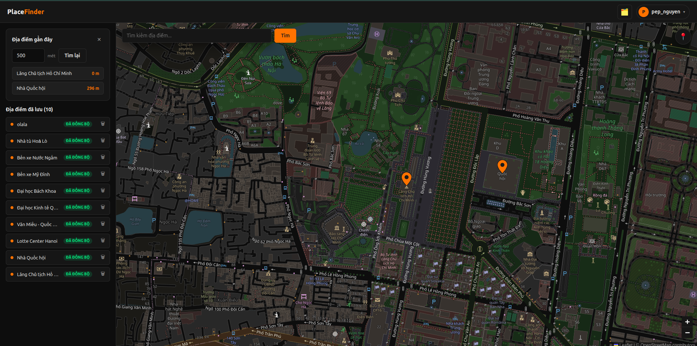
 
### 8. Tìm địa điểm gần 1 vị trí
 
Trong các trường hợp sau:
 
- Click vào 1 địa điểm trên sidebar
- Click vào 1 địa điểm được đánh dấu trên bản đồ
- Click vào 1 địa điểm vừa tìm kiếm
- Click vào 1 vị trí bất kỳ không được đánh dấu trên bản đồ
> → **Kết quả:** Sidebar sẽ hiện 1 form để tìm các địa điểm **đã lưu**
> trước đó, cách vị trí user vừa chọn trong khoảng cách (đơn vị mét) mà
> user tự nhập.
 
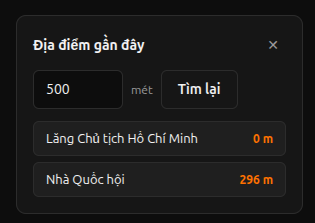
 
### 9. Lưu địa điểm từ kết quả tìm kiếm
 
Nếu chọn 1 địa điểm sau khi tìm kiếm (địa điểm đã được đánh dấu sẵn trên
bản đồ), sidebar sẽ hiện form lưu địa điểm — **tên địa điểm không thể
chỉnh sửa** trong trường hợp này.
 
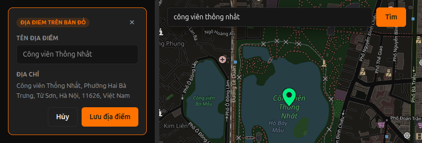
 
### 10. Lưu địa điểm tự chọn (không qua tìm kiếm)
 
Nếu user click ngẫu nhiên 1 vị trí trên bản đồ mà không được đánh dấu sẵn,
sidebar sẽ hiện form lưu địa điểm — trong trường hợp này **user có thể tự
chỉnh sửa tên địa điểm**.
 
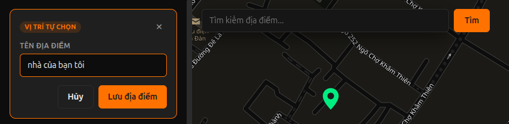
 
### 11. Trạng thái đồng bộ — mất mạng
 
Nếu mất mạng lúc đang lưu, bản ghi sẽ hiển thị trạng thái **Đang đồng bộ**,
đồng thời header hiện thông báo mất kết nối.
 
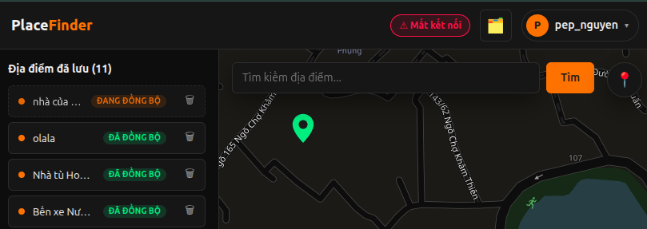
 
### 12. Trạng thái đồng bộ — server lỗi
 
Nếu client vẫn còn mạng nhưng server bị lỗi/ngừng hoạt động, bản ghi sẽ
hiển thị trạng thái **Lỗi đồng bộ**. Sau khi server kết nối trở lại, user có
thể bấm để tự thử lại (retry) thủ công, hoặc hệ thống sẽ tự động retry sau
mỗi 20 giây.
 
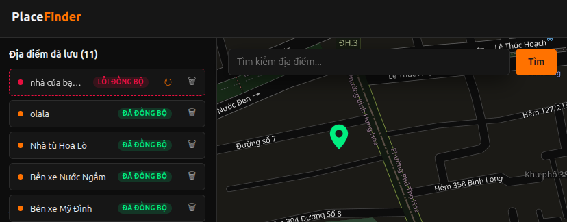
 
### 13. Phát hiện nghi ngờ trùng
 
Khi user tự chọn 1 vị trí không được đánh dấu để lưu, nếu tên địa điểm quá
giống với 1 địa điểm đã có và khoảng cách đủ gần, hệ thống sẽ hiện thông
báo ở icon cạnh tên user (góc trên bên phải). Bấm vào icon đó sẽ mở 1 modal
hiển thị danh sách các nhóm nghi ngờ trùng. Với mỗi nhóm, user có 2 lựa
chọn:
 
- Chọn 1 địa điểm muốn giữ lại, đồng ý xóa các địa điểm còn lại trong nhóm
- Chọn "không trùng" — các địa điểm trong nhóm được xem là riêng biệt
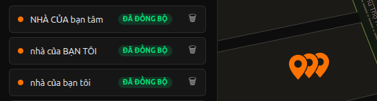
 
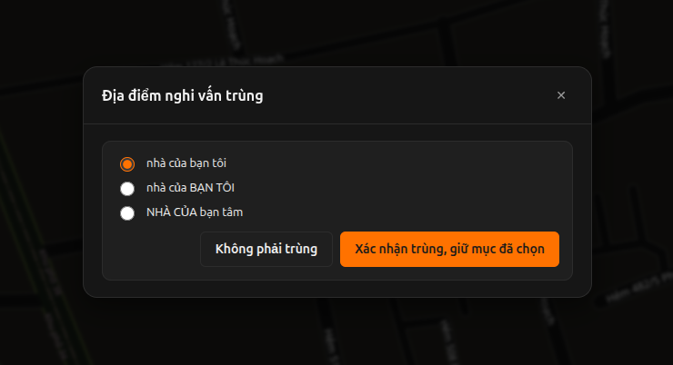
 
### 14. Thêm tài khoản mới
 
Bấm vào tên user ở góc trên bên phải màn hình, một menu sẽ hiện xuống —
chọn **Thêm tài khoản** để quay về màn hình đăng nhập/đăng ký ban đầu.
 
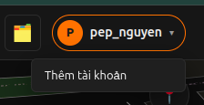
 

## Tóm tắt các API chính (Backend)

| Method | Endpoint | Mô tả |
|---|---|---|
| POST | `/users/login` | Tạo mới 1 user hoặc đăng nhập |
| POST | `/places/create/:userId` | Tạo mới 1 địa điểm |
| GET | `/places/get/:userId` | Lấy danh sách địa điểm của user |
| GET | `/places/getNearby/:userId/:lat/:lng/:radius` | Tìm địa điểm gần 1 tọa độ |
| DELETE | `/places/delete` | Xóa nhiều địa điểm (body: `{ placeIds: [...] }`) |
| GET | `/places/getpotentialduplicates/:userId` | Lấy danh sách nghi ngờ trùng |
| DELETE | `/places/delete/:id` | Xóa 1 nhóm nghi ngờ trùng đã xử lý xong |

## Test API bằng Bruno

Collection Bruno mẫu nằm trong thư mục `Place/` ở gốc repo (cạnh `User/`) —
mở bằng [Bruno](https://www.usebruno.com/), chọn environment `local`, và chạy
thử từng request.

## Troubleshooting nhanh

- **Lỗi kết nối MongoDB**: kiểm tra `DATABASE_URL` trong `BE/.env`, đảm bảo
  MongoDB đang chạy (local) hoặc chuỗi kết nối Atlas đúng.
- **Prisma báo thiếu model/field**: chạy lại `npx run build` sau khi
  chỉnh sửa `schema.prisma`.
- **Frontend không gọi được API**: kiểm tra `VITE_API_BASE_URL` trong
  `FE/.env` có khớp với cổng backend đang chạy không, và CORS đã bật ở
  backend cho phép origin của frontend.

